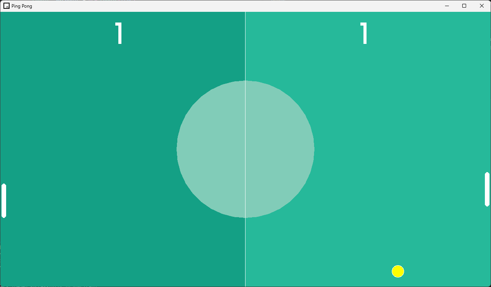

# Pong
Es un videojuego basado en el juego de ping pong (o tenis de mesa), elaborado con **`C++`** y **`raylib`**.

## Estructura
- **`main`** archivo central que contiene el patron ***Game Loop*** y ejecuta el resto de *clases* de forma ordenada.
- **`ball`** clase de la pelota del juego que maneja la velocidad, cordenadas y HitBox de la misma.
- **`stage`** escenario del juego o podria decirse el fondo de este.
- **`paddles`** raquetas del jugador y de la CPU.
- **`scoreBoard`** tabla de puntajes del jugador y de la CPU.

## Herramientas
- __Raylib__
- __Visual Studio Code__

### Imagenes

    

